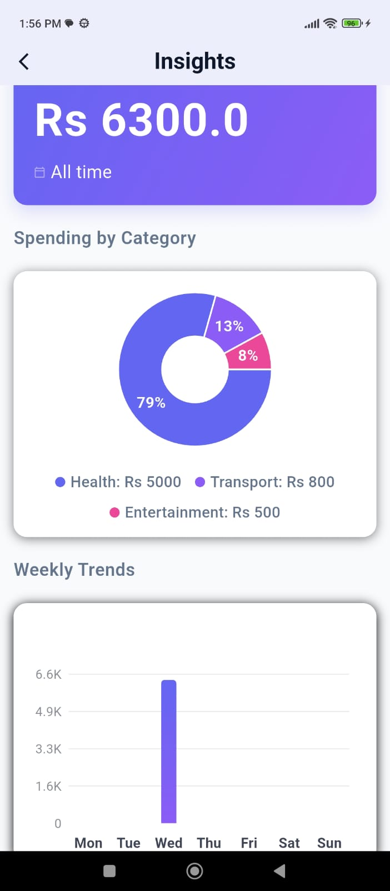
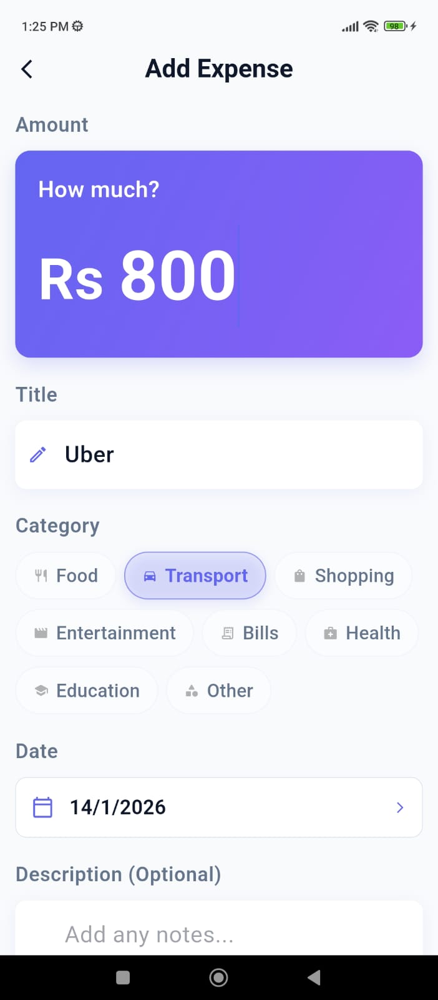
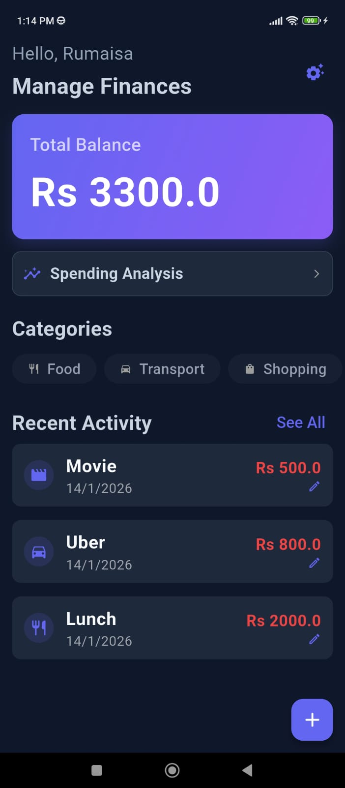
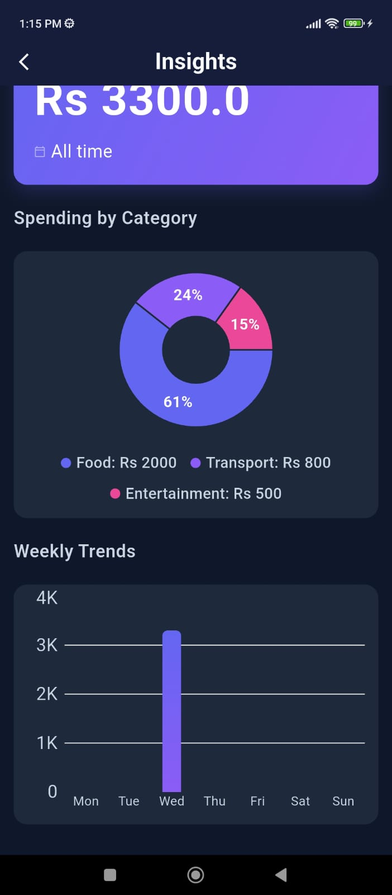
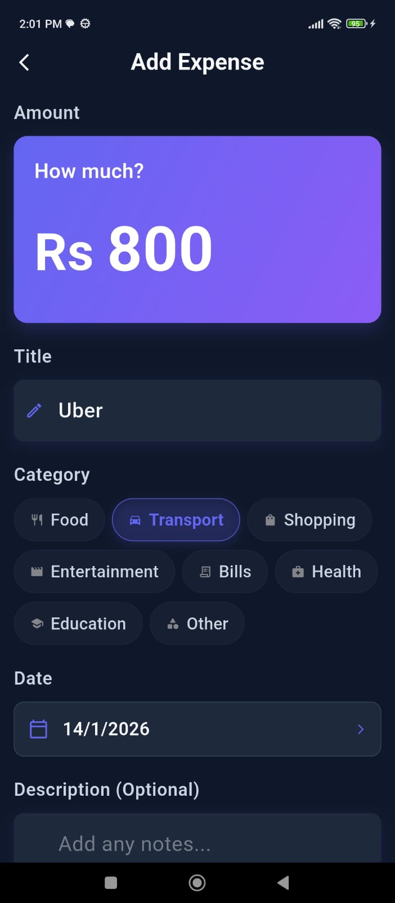

# Expense Ledger

A personal finance tracker built with Flutter featuring real-time analytics,
category-based expense management, and a full dark/light theming system.

[](https://flutter.dev/)
[](https://dart.dev/)
[](https://pub.dev/packages/hive)
[](https://pub.dev/packages/provider)
[](https://m3.material.io/)

---

## Tech Stack

| Layer | Technology |
|---|---|
| Framework | Flutter |
| State Management | Provider |
| Local Storage | Hive NoSQL |
| Charts | fl_chart |
| Design System | Material 3 |

---

## Architecture

Provider-based layered architecture with isolated domain providers:

- **ExpenseProvider** — CRUD operations, category filtering, aggregation logic
- **ThemeProvider** — adaptive theme management (System / Light / Dark)
- **PreferencesProvider** — persistent user preferences via SharedPreferences

Hive selected for binary storage format and O(1) indexed reads — ensures
Charts and large datasets render without lag.

---

## Features

**Ledger Management**
- Full CRUD with persistent local storage
- 8 expense categories with custom icons
- Swipe-to-action gestures with haptic feedback

**Analytics**
- Weekly trend charts with dynamic auto-scaling
- Pie chart spending distribution by category
- Real-time state sync across all modules

**Design**
- Material 3 with high-contrast typography
- System, Light, and Dark theme support
- Responsive layout across screen sizes

---

## Screenshots

### Light Mode

| Dashboard | Analytics | Add Expense |
|---|---|---|
|  |  |  |

### Dark Mode

| Dashboard | Analytics | Add Expense |
|---|---|---|
|  |  |  |

---

## Setup
```bash
git clone https://github.com/Rumaisa19/ExpenseLedger.git
cd ExpenseLedger
flutter pub get
flutter run
```

---

## Developer

**Rumaisa Mushtaq** — Flutter Developer
- GitHub: [Rumaisa19](https://github.com/Rumaisa19)
- LinkedIn: [rumaisamushtaq](https://linkedin.com/in/rumaisamushtaq)
```
